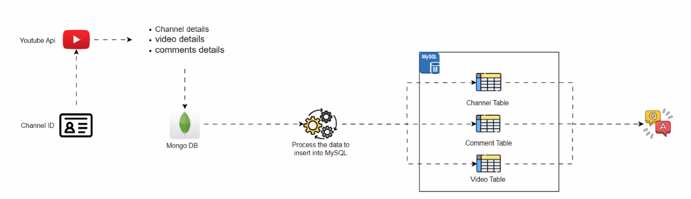

###### YouTube Data Harvesting and WareHousing
**PROBLEM STATEMENT:**
    The problem statement is to create a Streamlit application that allows users to access and analyze data from multiple YouTube channels.
The application should have the following feautres:
1. Ability to input a YouTube channel ID and retrieve all the relevant data (Channel name, subscribers, total video count, playlist ID, video ID, likes, dislikes, comments of each video) using Google API.
2. Option to store the data in a MongoDB database as a data lake.
3. Ability to collect data for up to 10 different YouTube channels and store them in the data lake by clicking a button.
4. Option to select a channel name and migrate its data from the data lake to a SQL database as tables.
5. Ability to search and retrieve data from the SQL database using different search options, including joining tables to get channel details.

**WORKFLOW DIAGRAM:**

**INTRODUCTION:**
YouTube Data Harvesting and Warehousing is a project aimed at developing a user-friendly Streamlit application that leverages the power of the Google API to extract valuable information from YouTube channels. The extracted data is then stored in a MongoDB database, subsequently migrated to a SQL data warehouse, and madeccessible for analysis and exploration within the Streamlit app.

**KEY TECHNOLOGIES AND SKILLS:**
* Python scripting
* Data Collection
* API integration
* Streamlit
* Data Management using MongoDB and SQL

**INSTALLATION:**
To run this project, you need to install the following packages:
* pip install google-api-python-client
* pip install pymongo
* pip install pandas
* pip install mysql-connector-python
* pip install streamlit
    
**Usage:**
To use this project, follow these steps:
1. Clone the repository: git clone https://github.com/srinivas-ete/Youtube_DataHarvesting_And_Warehousig.git
2. Install the required packages: pip install -r requirements.txt
3. Run the Streamlit app: streamlit run Youtube_Project.py
4. Access the app in your browser at http://localhost:8501

**FEATURES:**
1. Retrieve data from the YouTube API, including channel information, playlists, videos, and comments.
2. Store the retrieved data in a MongoDB database.
3. Migrate the data to a SQL data warehouse.
4. Perform queries on the SQL data warehouse.

**Retrieving data from the YouTube API**
The project utilizes the Google API to retrieve comprehensive data from YouTube channels. The data includes information on channels, playlists, videos, and comments. By interacting with the Google API, we collect the data and merge it into a JSON file.

**Storing data in MongoDB**

The retrieved data is stored in a MongoDB database based on user authorization. If the data already exists in the database, it can be overwritten with user consent. This storage process ensures efficient data management and preservation, allowing for seamless handling of the collected data.

**Migrating data to a SQL data warehouse**

The application allows users to migrate data from MongoDB to a SQL data warehouse. Users can choose which channel's data to migrate. To ensure compatibility with a structured format, the data is cleansed using the powerful pandas library. Following data cleaning, the information is segregated into separate tables, including channels, playlists, videos, and comments, utilizing SQL queries.

**Conclusion:**

This project has demonstrated how to harvest and warehouse YouTube data using SQL, MongoDB, and Streamlit. This approach can be used to collect, store, and analyze data from a variety of sources.